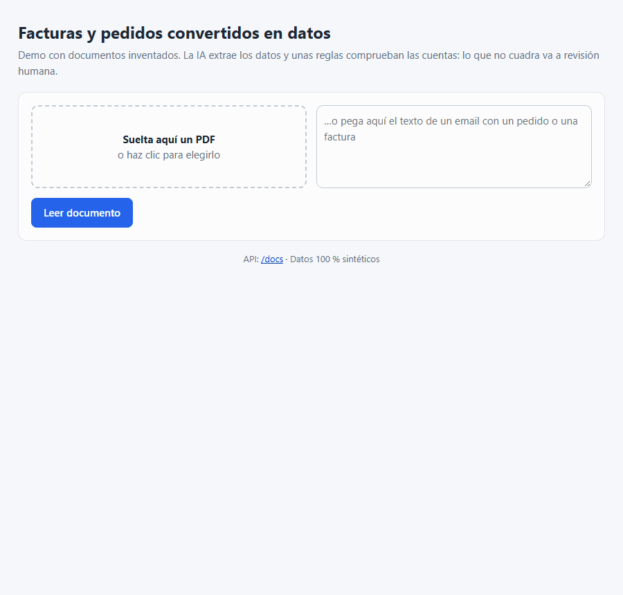

# Facturas y pedidos en PDF convertidos en datos, sin teclear

**EN** · Turns invoices and orders (PDF or email) into validated data with AI, and flags anything that doesn't add up for human review.

Para empresas que reciben facturas, albaranes y pedidos por email y hoy los copian a mano en su programa de gestión.

## Qué hace
- Lee una factura o un pedido (PDF o texto de un email) y devuelve sus datos ordenados: emisor, NIF, fecha, líneas, base, IVA y total
- Repasa las cuentas y el NIF; lo que no cuadra pasa a revisión humana en lugar de inventarse
- No procesa dos veces el mismo documento
- Aguanta muchos documentos a la vez: los pone en cola y los procesa en segundo plano
- Avisa automáticamente al terminar, para conectarlo con herramientas como n8n

## Resultado
- Lee **perfectamente 49 de cada 50 documentos** de prueba (98 %), en unos **3 segundos** cada uno y por menos de 0,1 céntimos
- **Ningún documento con errores se dio por bueno**: el que falló fue a revisión humana

Examen con 50 facturas, albaranes y pedidos inventados · modelo gpt-4.1-mini · 28/09/2026 · [detalle](docs/TECNICO.md#evaluación)

## Tecnologías
Python · FastAPI · IA (OpenAI y modelos locales) · Pydantic · PostgreSQL · Redis · Docker · GitHub Actions

## Mi papel
Lo he diseñado y desarrollado de principio a fin. Desarrollo asistido por IA bajo mi especificación y revisión.

[Detalles técnicos →](docs/TECNICO.md) · [LinkedIn](https://www.linkedin.com/in/miquel-moreno-martinez)
